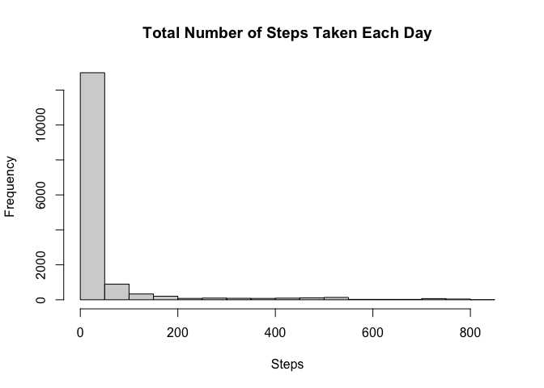
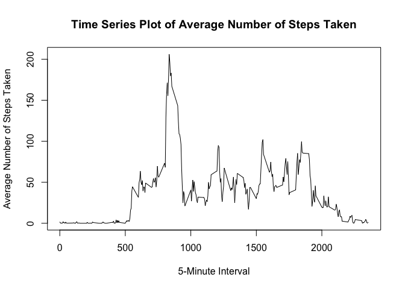
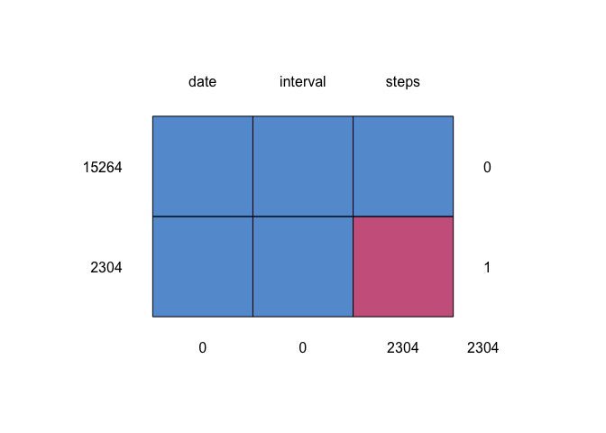
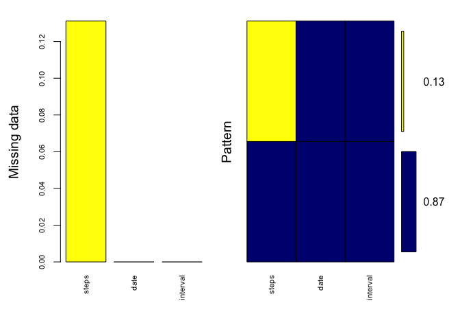
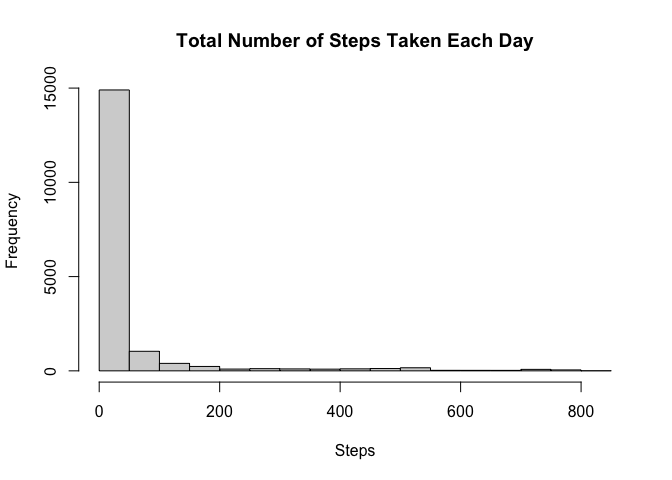
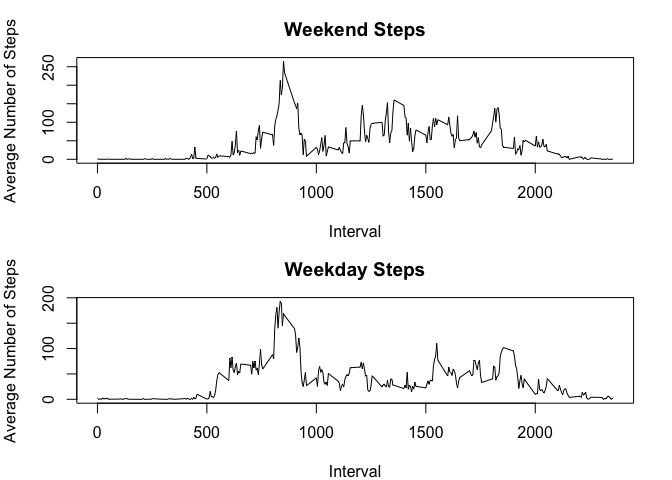

## Download Data
We check whether a data directory and data exists or not. If there is not any 
such drectory we create the folder and download the file.


```r
setwd <- "./"
if(!dir.exists("Activity monitoring data")) { dir.create("Activity monitoring 
                                                         data") }
file.url   <- "https://d396qusza40orc.cloudfront.net/repdata%2Fdata%2Factivity.zip"

file.path  <- "Activity monitoring data/repdata_data_activity.zip"
file.unzip <- "Activity monitoring data/repdata_data_activity.zip"

if(!file.exists(file.path) & !file.exists(file.unzip)) {
    download.file(file.url, file.path)
    unzip(file.path, exdir = "Activity monitoring data")
}
```

## Load Data

We load the csv file and store in dfvariable:


```r
df <- read.csv("./Activity monitoring data/activity.csv", header = TRUE)
```

## Hisotgram of Total Number of Steps Taken Each Day

Histogram with number of steps taken each day in x axis and frequency in y axis


```r
hist(df$steps, main = "Total Number of Steps Taken Each Day", xlab = "Steps")
```

<!-- -->

## Mean & Median Number of Steps Taken Each Day

Return the Mean & Median Value for Steps Taken Each Day without NAs


```r
library(plyr);library(dplyr)
f <- function(x){
        list(mean(x, na.rm = TRUE), median(x, na.rm = TRUE))
}
df1 <- select(df, steps)  
as.data.frame(sapply(df1, f), row.names = c("Mean", "Median"))
```

```
##          steps
## Mean   37.3826
## Median       0
```

## Time Series Plot of Avg Steps Taken

Time Series Plot of Daily Average Number of Steps Taken


```r
df$date <- as.Date(df$date)
df2 <- select(df, c("steps", "interval")) %>% na.omit()
df2 <- aggregate(df2, by=list(df2$interval), mean)
plot(df2$Group.1, df2$steps, xlab = "5-Minute Interval", 
     ylab = "Average Number of Steps Taken", type = "l",
     main = "Time Series Plot of Average Number of Steps Taken")
```

<!-- -->

## The 5-minute interval that, on average, contains the maximum number of steps

Return the 5-minute interval with highest step count


```r
df[max(df$steps, na.rm = TRUE),]
```

```
##     steps       date interval
## 806    41 2012-10-03     1905
```

## Code to describe and show a strategy for imputing missing data

Total Number of Rows with NAs are


```r
sum(!complete.cases(df))
```

```
## [1] 2304
```

The mice package implements a method to deal with missing data. The package creates multiple imputations (replacement values) for multivariate missing data. The method is based on Fully Conditional Specification, where each incomplete variable is imputed by a separate model. The MICE algorithm can impute mixes of continuous, binary, unordered categorical and ordered categorical data. In addition, MICE can impute continuous two-level data, and maintain consistency between imputations by means of passive imputation. Many diagnostic plots are implemented to inspect the quality of the imputations.

Generates Multivariate Imputations by Chained Equations (MICE)


```r
library("mice")
md.pattern(df)
```

<!-- -->

```
##       date interval steps     
## 15264    1        1     1    0
## 2304     1        1     0    1
##          0        0  2304 2304
```

```r
library(VIM)
mice_plot <- aggr(df, col=c('navyblue','yellow'),
                    numbers=TRUE, sortVars=TRUE,
                    labels=names(df), cex.axis=.7,
                    gap=3, ylab=c("Missing data","Pattern"))
```

<!-- -->

```
## 
##  Variables sorted by number of missings: 
##  Variable     Count
##     steps 0.1311475
##      date 0.0000000
##  interval 0.0000000
```

```r
imputed_Data <- mice(df, m=5, maxit = 50, method = 'pmm', seed = 500)
```

```
## 
##  iter imp variable
##   1   1  steps
##   1   2  steps
##   1   3  steps
##   1   4  steps
##   1   5  steps
##   2   1  steps
##   2   2  steps
##   2   3  steps
##   2   4  steps
##   2   5  steps
##   3   1  steps
##   3   2  steps
##   3   3  steps
##   3   4  steps
##   3   5  steps
##   4   1  steps
##   4   2  steps
##   4   3  steps
##   4   4  steps
##   4   5  steps
##   5   1  steps
##   5   2  steps
##   5   3  steps
##   5   4  steps
##   5   5  steps
##   6   1  steps
##   6   2  steps
##   6   3  steps
##   6   4  steps
##   6   5  steps
##   7   1  steps
##   7   2  steps
##   7   3  steps
##   7   4  steps
##   7   5  steps
##   8   1  steps
##   8   2  steps
##   8   3  steps
##   8   4  steps
##   8   5  steps
##   9   1  steps
##   9   2  steps
##   9   3  steps
##   9   4  steps
##   9   5  steps
##   10   1  steps
##   10   2  steps
##   10   3  steps
##   10   4  steps
##   10   5  steps
##   11   1  steps
##   11   2  steps
##   11   3  steps
##   11   4  steps
##   11   5  steps
##   12   1  steps
##   12   2  steps
##   12   3  steps
##   12   4  steps
##   12   5  steps
##   13   1  steps
##   13   2  steps
##   13   3  steps
##   13   4  steps
##   13   5  steps
##   14   1  steps
##   14   2  steps
##   14   3  steps
##   14   4  steps
##   14   5  steps
##   15   1  steps
##   15   2  steps
##   15   3  steps
##   15   4  steps
##   15   5  steps
##   16   1  steps
##   16   2  steps
##   16   3  steps
##   16   4  steps
##   16   5  steps
##   17   1  steps
##   17   2  steps
##   17   3  steps
##   17   4  steps
##   17   5  steps
##   18   1  steps
##   18   2  steps
##   18   3  steps
##   18   4  steps
##   18   5  steps
##   19   1  steps
##   19   2  steps
##   19   3  steps
##   19   4  steps
##   19   5  steps
##   20   1  steps
##   20   2  steps
##   20   3  steps
##   20   4  steps
##   20   5  steps
##   21   1  steps
##   21   2  steps
##   21   3  steps
##   21   4  steps
##   21   5  steps
##   22   1  steps
##   22   2  steps
##   22   3  steps
##   22   4  steps
##   22   5  steps
##   23   1  steps
##   23   2  steps
##   23   3  steps
##   23   4  steps
##   23   5  steps
##   24   1  steps
##   24   2  steps
##   24   3  steps
##   24   4  steps
##   24   5  steps
##   25   1  steps
##   25   2  steps
##   25   3  steps
##   25   4  steps
##   25   5  steps
##   26   1  steps
##   26   2  steps
##   26   3  steps
##   26   4  steps
##   26   5  steps
##   27   1  steps
##   27   2  steps
##   27   3  steps
##   27   4  steps
##   27   5  steps
##   28   1  steps
##   28   2  steps
##   28   3  steps
##   28   4  steps
##   28   5  steps
##   29   1  steps
##   29   2  steps
##   29   3  steps
##   29   4  steps
##   29   5  steps
##   30   1  steps
##   30   2  steps
##   30   3  steps
##   30   4  steps
##   30   5  steps
##   31   1  steps
##   31   2  steps
##   31   3  steps
##   31   4  steps
##   31   5  steps
##   32   1  steps
##   32   2  steps
##   32   3  steps
##   32   4  steps
##   32   5  steps
##   33   1  steps
##   33   2  steps
##   33   3  steps
##   33   4  steps
##   33   5  steps
##   34   1  steps
##   34   2  steps
##   34   3  steps
##   34   4  steps
##   34   5  steps
##   35   1  steps
##   35   2  steps
##   35   3  steps
##   35   4  steps
##   35   5  steps
##   36   1  steps
##   36   2  steps
##   36   3  steps
##   36   4  steps
##   36   5  steps
##   37   1  steps
##   37   2  steps
##   37   3  steps
##   37   4  steps
##   37   5  steps
##   38   1  steps
##   38   2  steps
##   38   3  steps
##   38   4  steps
##   38   5  steps
##   39   1  steps
##   39   2  steps
##   39   3  steps
##   39   4  steps
##   39   5  steps
##   40   1  steps
##   40   2  steps
##   40   3  steps
##   40   4  steps
##   40   5  steps
##   41   1  steps
##   41   2  steps
##   41   3  steps
##   41   4  steps
##   41   5  steps
##   42   1  steps
##   42   2  steps
##   42   3  steps
##   42   4  steps
##   42   5  steps
##   43   1  steps
##   43   2  steps
##   43   3  steps
##   43   4  steps
##   43   5  steps
##   44   1  steps
##   44   2  steps
##   44   3  steps
##   44   4  steps
##   44   5  steps
##   45   1  steps
##   45   2  steps
##   45   3  steps
##   45   4  steps
##   45   5  steps
##   46   1  steps
##   46   2  steps
##   46   3  steps
##   46   4  steps
##   46   5  steps
##   47   1  steps
##   47   2  steps
##   47   3  steps
##   47   4  steps
##   47   5  steps
##   48   1  steps
##   48   2  steps
##   48   3  steps
##   48   4  steps
##   48   5  steps
##   49   1  steps
##   49   2  steps
##   49   3  steps
##   49   4  steps
##   49   5  steps
##   50   1  steps
##   50   2  steps
##   50   3  steps
##   50   4  steps
##   50   5  steps
```

```r
summary(imputed_Data)
```

```
## Class: mids
## Number of multiple imputations:  5 
## Imputation methods:
##    steps     date interval 
##    "pmm"       ""       "" 
## PredictorMatrix:
##          steps date interval
## steps        0    1        1
## date         1    0        1
## interval     1    1        0
```

```r
completeData <- complete(imputed_Data,2)
```

## Histogram of the total number of steps taken each day after missing values are imputed

Using Multivariate Imputations by Chained Equations missing values are imputed 
and then histogram is formed.


```r
hist(completeData$steps, main = "Total Number of Steps Taken Each Day", xlab = 
             "Steps")
```

<!-- -->

## Mean & Median Number of Steps Taken Each Day for Complete Data

Return the Mean & Median Value for Steps Taken Each Day for imputed dataset


```r
library(plyr);library(dplyr)
f <- function(x){
        list(mean(x, na.rm = TRUE), median(x, na.rm = TRUE))
}
df3 <- select(completeData, steps)  
as.data.frame(sapply(df3, f), row.names = c("Mean", "Median"))
```

```
##          steps
## Mean   38.2179
## Median       0
```

## Panel plot comparing the average number of steps taken per 5-minute interval across weekdays and weekends


```r
library("lubridate")
completeData$wday <- ifelse(wday(completeData$date) %in% c(6,7), "Weekend",
                            "Weekday")

par(mfrow = c(2, 1), mar = c(4,4,3,2))
dfweekend <- aggregate(completeData[completeData$wday == "Weekend",], 
          by = list(completeData[completeData$wday == "Weekend",]$interval), 
          mean)
plot(dfweekend$Group.1, dfweekend$steps, type = "l", xlab = "Interval",
     ylab = "Average Number of Steps", main = "Weekend Steps")

dfweekday <- aggregate(completeData[completeData$wday == "Weekday",], 
                       by = list(completeData[completeData$wday == "Weekday",]$interval), 
                       mean)
plot(dfweekday$Group.1, dfweekday$steps, type = "l", xlab = "Interval",
     ylab = "Average Number of Steps", main = "Weekday Steps")
```

<!-- -->
